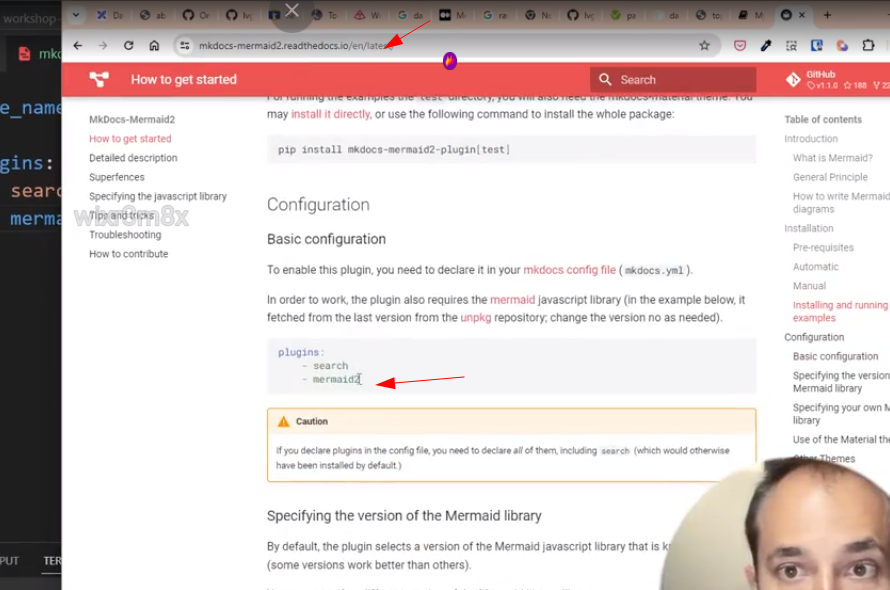
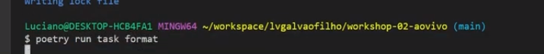
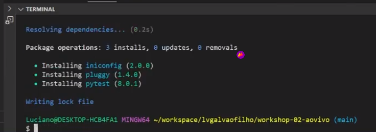
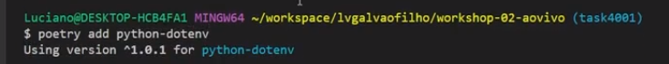
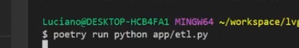
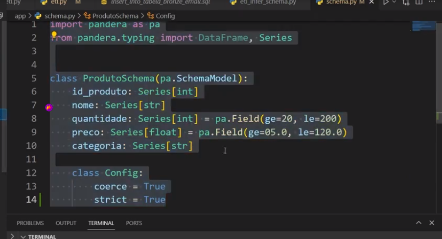
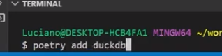
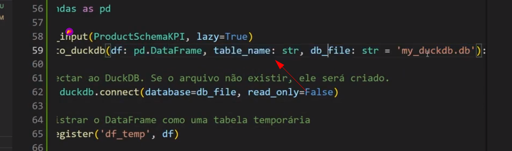

# Como fazer Contrato de Dados (Qualidade de Dados)

Ao se falar de Qualidade de Dados e a sua implementação, seria garantir que os dados sempre estejam disponíveis e sejam confiáveis.

Nesse workshop, será feito uma ETL em Python, inserindo o processo de DataQuality. Esse ETL teremos uma consulta em uma API JSON e salvar os dados em um banco de dados PostGres SQL.

Para fazer esse ETL com o contrato de dados, vamos usar o Pandera ou o Pydantic.


Figura 01 - Contrato de dados usando o Pydantic ou o Pandera.

### Qual a diferença do Pydantic e do Pandera ?

Ambas são para validação dos dados no início do processo de contrato de dados. Porém o Pandera, é mais indicado para alto volume de processamento de dados e para tempo real (Indicado para Big Data).

Uma ótima representação do uso do Pydantic e do Pandera no início do processo de ETL. Porém, normalmente, essa validação é feito no processo de LOAD. Sendo que o contrato de dados busca em fazer essa validação já na extração. Na camada de LOAD, a gente fica muito reativo. Fazendo na extração, poderemos fazer no início do processo.


Figura 02 - Contrato de dados na camada de Load e seus exemplos de ferramentas.

# Começando o projeto de contrato de dados (Qualidade dos dados)


1 - Criando um repositório do Zero - Acessar o Git hub, criar um repositório público, obter os códigos para executar no terminal e assim atribuir a pasta do projeto ao github.


Figura 03 - Criando o Github na pasta do projeto.


Figura 04 - Checklist do projeto.


Figura 05 - PDF com o Checklist de todo projeto.


2 - Pyenv - permitir você trabalhar com multiplas versões de python. Para cada projeto que você for desenvolver, no nível de pasta será possível utilizar uma versão específica. Porém, como escolher a versão do pyenv para utilizar (versão do python) ? Fazer o brainstrom das ferramentas do projeta e escolher a versão do pyenv que vai atender a essas ferramentas. No nosso caso, vamos usar o Pydanitc, Pandera, Pandas, Dask e o DuckDB. Dessas todas, o pandera é a única que ainda não foi atualizada para o python 3.12. Com isso, vamos usar a versão 3.11.


Figura 06 - Por causa do Pandera, vamos usar a versão 3.11 do Python.


Selecionando a versão mais avançada para o 3.11. que é a 3.11.5.


Figura 07 - Na pasta do projeto, selecionar o pyenv local 3.11.5

Com a execução do comando pyenv local, automaticamente é criado um arquivo .python-version no projeto.


Figura 08 - Arquivo .python-version

3 - Depois de escolher versão do pyenv adequada, é chegada a hora de fazer o uso do poetry. Executar o poetry init.


Figura 09 - Executando o comando poetry init na pasta do projeto e clicar enter em todos os passos para deixar em branco as opções.

Com o poetry init executado, automaticamente é criado uma pasta pyproject.toml, com as informações do projeto.


Figura 10 - Arquivo pyproject.toml.

IMPORTANTE: Para usar o ambinete virtual local com o poetry, é preciso executar o comando poetry shell na pasta do projeto e assim automaticamente será criado uma pasta .venc para desenvolvimento.


Figura 11 - Comando poetry shell.

4 - Instalação do mkdocs. Biblioteca para fazer a documentação do projeto. 

Criar o arquivo do gitignore, só para não ter de enviar arquivos indesejados para o repositório do github. Existe um site que informa todos os arquivos que não devem ser enviados para o github. Acessar a página git total e informar para lista o padrão do gitigone para python.


Figura 12 - Gitignore para Python.


Instalação da biblioteca do mkdocs. Nesse caso vamos usar o poetry para fazer as instalações, pois esses softwares só existirão em nível de projeto. Usar o comando poetry add.


Figura 13 - Poetry add mkdocs.

Para começar a usar o mkdocs, pasta executar o comando mkdocs new. e automaticarmente será criado uma pasta docs no projetos.


Figura 14 - Iniciando o mkdocs com o comando "mkdocs new ."

Em outra janela do bash, executar comando "poetry run mkdocs serve" para iniciar o mkdocs.


Figura 15 - Acessando a UI do mkdocs.

Acessar a página que está renderizando o arquivo index.md:


Figura 16 - Acesso ao UI Web do mkdocs com as informações do arquivo index.md.

### Dica de como fazer uma documentação rápida no mkdocs.

Usar a extensão chamada "mermaid" para ajudar a fazer os organogramas para o mkdocs. Acessar o site:


Figura 17 - Acessar o site da mermaid.

Fazer a instalação do mermaid para o mkdocs:


Figura 18 - Instalação do plugin entre aspas.

Modificar o arquivo mkdocs.yml para ficar da forma abaixo:



Figura 19 - Ajuste do arquivo yml.


Figura 20 - Ajuste do arquivo yml.

O que já podemos fazer com o mermaid em execução ? 

Vamos obter um exemplo de fluxograma e informar no modo mermaid.

Exemplo de um digrama do mermaid:


Figura 21 - Diagrama do mermaid.

Inserir o arquivo no index.md:


Figura 22 - Arquivo index.md com o diagrama mermaid.


Figura 23 - Executar o poetry run mkdocs serve


Figura 24 - Página com o diagrama documentado.


Outro ponto muito importante, pois tem uma extensão do excalidraw que transforma o desenho do mesmo e transforma em mermaid.

Selecionar o triangulo e inserir o comando mermaid nesse board:


Figura 25 - Excalidraw reconhecendo o mermaid.

**ATENÇÃO**:Convertendo um fluxograma feito no excel para ser inserido no mkdocs usando o mermaid. Copiar o fluxograma do excel e inserir o chat gpt e solictar para ele converter para mermaid.

5 - Fazer a instalação do mkdocs material, para adequar o layout do mkdocs.


Figura 26 - mkdocs material.

Editar o arquivo mkdocs.yml para reconhecer o thema mkdocs material:


Figura 27 - Editando o arquivo mkdocs.yml para reconhecer o novo tema.

6 - Incluindo o plugin docstring.

Instalação do mkdocs string:


Figura 28 - No nosso exemplo não precisa do pacote cristal.


Figura 29 - Editando o arquivo mkdocs.yml para reconhecer o mkdocsstring.

7 - Instalalação do Taskpi.

Excecutar o comando poetry shell em caso de novo terminal e em seguida, executar poetry add taskpy.


Figura 30 - Instalando o taskpi.

### Para que ser o Taskpy ?

Para comando que precisa ficar executando a todo momento, o taskpy ajuda automatizar essas repetiçoes.

Editar o arquivo pyproject.toml e inserir os comandos abaixo:


Figura 31 - Editando o pyproject file para usar o taskpi.

```python
[tool.taskipy.tasks]
format = """
isort .
black .
"""
kill = "kill -9 $(lsof -t -i :8000)"
test = "pytest -v"
run = """
python3 app/main.py
"""
doc = "mkdocs serve"
```

Por exemplo, ao invés de executar o comando mkdocs serve, vamos passar apenas a executar "poetry run task docs" para ligar o "servidor" para acesso do mkdocs user UI.


Figura 32 - Usando o taskpi para digitar comandos recorrentes.

Instalando o isort e o black para que possamos usar o taskpi para validar o nosso código em termos de formatação e identação, com base no PEP8.

```bahs
poetry add isort
poetry add black
```


Figura 33 - Instalando o isort.



Figura 34 - Executando "poetry run task format" para usar o isort com base no taskpy.



Figura 35 - Executando o "poetry add pytest".


# Como fazer a instalação do CI/CD ?


O que seria CI? Seria fazer um teste do projeto antes mesmo de ele ser disponibilizado para produção.

Para configurar o nosso CI/CD no projeto, vamos fazer a criação das pastas github >> worflows e nela, criar o arquivo CI.yml onde o conteúdo abaixo de ser inserido no mesmo.


Figura 35.1 - Breve resumo do conceito de CI/CD.

**Somente será possível fazer o merge no github se o seu código passar na rotina de testes do CI/CD implementado no github. Essa forma automatizada é para garantir que todos os testes serão feitos e que não será deixado nada com o desenvolvedor**

```python
name: ci

on: push
jobs:
    build-and-test:
        runs-on: ubuntu-latest
        steps:
            - name: Baixar o repositório
              uses: actions/checkout@v4

            - name: Instalar o Python
              uses: actions/setup-python@v5
              with:
                python-version: 3.11.5

            - name: Instalar o Poetry via pip
              run: pip install poetry

            - name: Instalar dependências com o Poetry
              run: poetry install

            - name: Rodar minha rotina de testes com o Poetry
              run: poetry run pytest tests -v
```


Figura 36 - Criação da pasta github com o arquivo yml.


## Fazendo o primeiro teste para o CI

Criar a pasta app e tests.


Figura 37 - Criando a pasta app e tests

Criar um arquivo .py na pasta tests para começar a validar o conceito de CI. Como vamos usar o pytest, é necessário criar o arquivo __init__.py na pasta de tests.


Figura 38 - Iniciando a estrutura da pasta tests.


Ler um pouco mais sobre o conceito de desenvolvimento TDD:


Figura 39 - Conceito TDD.

Para fazer o test funcionar no conceito CI:

- Criar uma função .py na pasta tests onde o arquivo terá o nome de olá turma.
- Em seguida criar um arquivo na pasta app, onde o mesmo terá um nome de funcao.py.
- Criar um código ola_turma.py na pasta de tests.
- Ao fim disso, executar o comando "poetry run task test"


Figura 40 - Executando o comando "poetry run task test".

Código para o arquivo funcao.py que está na pasta app:

```python
def funcao_ola_turma():
    return "ola jornada"

```

Criar uma arquivo na pasta tests chamado test_funcao_ola_turma.py e inserir o código abaixo:

```python
from app.funcao import funcao_ola_turma

def test_funcao_ola_turma_retorna_ola_jornada():
    saida = funcao_ola_turma()
    gabarito = 'ola jornada'
    assert saida == gabarito
```

Executar a etapa de testes:


Figura 41 - Executando o "poetry run pytest tests -v"


Figura 42 - Testes executado com sucesso.

**Basicamente o TDD possui o conceito de executar primeiramente o testes para depois desenvolver as funções**

# Ponto importante para o "blindar" o primeiro commit em PRD.

Depois do seu primeiro ponto concreto de aplicação em produção sem nenhum erro, logo após o commit no github, será necessário fazer uma configuração para blindar o código que está em produção. Ou seja, caso o desenvolvedor faça um commit em PRD que tenha erro, se tivermos uma rotina de aprovação primeiro, vai eliminar da possibilidade de termos um código ruim publicado em produção.

Vamos aos passos:

1 - Assim que tiver o primeiro pytest executando com sucesso, fazer o "git add .", em seguida o "git commit -m "<Qualquer mensagem que vc desejar>" " e por fim o git push.

2 - Depois ir no github, em branches >> add protection rule.


Figura 43 - Ir em braches >> add protection rule.


Selecionar Require a pull request before merging.


Figura 44 - Require a pull request.

O ideal é que selecione também a opção require approvals mas para fins de lab não faz sentido pois a mesma pessoa que faz a requisição de pull request não pode ser a mesma para aprovar.

Como administrador, o pull request pode seguir fazendo o by pass. Para fins de estudos, devemos selecionar a opção abaixo.


Figura 45 - Não permitir que o administrador possa fazer bypass.

Vamos fazer um teste para saber se é possível fazer um commit na main:

- criar um arquivo chamado "main.py":


Figura 46 - Criar arquivo main.py

Agora fazer o processo de "git add ." e em seguida fazer o "git commit -m "<inserir uma mensagem explicativa do motivo do commit na main>" e depois o git push".

Vejamos o erro, pois fizemos a configuração do pull request.


Figura 47 - Devido a proteção na branche main, tivemos um erro no processo de commit.

## E agora, como fazer o processo de commit corretamente ?

Já que nesse momento temos uma regra de proteção para não termos commit na branche main diretamente, será necessário fazer a rotina completa de pull request e aprovação.

Nesse caso é fazer uma estratégia de Branch. Vejamos o passos a seguir:

1 - Executar o comando "git checkout -B <nome da branch a ser usada>"


Figura 48 - Executando o git checkout na branch de nome "task4001"

2 - Vamos tentar criar e submeter o arquivo main.py novamente.


Figura 49 - Fazendo commit.

3 - Fazer o git push.


Figura 50 - Executando o git push.

4 - Git ao Github e automaticamente você verá uma mensagem de solicitação de pull request. Cliar em Compare & pull request.


Figura 51 - Avaliando e aprovando pull request.

5 - Clicar em "Create pull request"


Figura 52 - Clicar em "Create pull request"

6 - Automaticamente o teste será executado.


Figura 53 - Executando os testes para fazer o deploy na main.


Figura 54 - Deploy na main executando com sucesso.


Figura 55 - Fazer o "Close pull request".

# Desafio de ler 1 bilhão de linhas

Case para fazer o processo de ler 1 bilhão de linhas.


Figura 56 - Case para ler 1 bilhão de linhas.


Fazer o Git Clone do projeto de 1 bilhão de linhas:


Figura 57 - Fazendo o git clone.


Figura 58 - Fazendo o git clone.


Figura 59 - Pasta com o arquivo gerado, apenas para fins de adiantar o lab.

Exemplo de códigos para fazer a leitura de 1 bilhão de linhas. Temos exemplos para fazer essa leitura usando python, polars, pandas, duckdb e dask.


Figura 60 - Exemplo para fazer leitura de 1 bilhão de linhas.

*ATENÇÃO: para não ter conflitos para executar os arquivos .py desse projeto, excluir os arquivos ".python-version", "poetry.lock" e "pyproject.toml".

Em seguida, tentar fazer a execução do arquivo .py do projeto de leitura de 1 bilhão de linhas.

```bash
poetry run python src/using_python_old.py
```


Figura 61 - Executando o processo de leitura do arquivo.

Instalar o software tqdm para visualizar o processo de leitura e criação dos arquivos.


Figura 62 - Executando "poetry add tqdm"


Figura 63 - Local do código onde é informando a quantidade de linhas a serem geradas e o bloco médio para ajudar no processo da barra de progresso do tqdm.


Figura 64 - Iniciando o processo de geração do arquivo.


Executar o processo de leitura do arquivo usando o duck_db:


Figura 65 - Instalando o duckdb.


Figura 66 - Executando com o duckdb.

## O que esses arquivos possuem em comum ?

Sim, possuem estrutura de dados que precisam ser validadas e de acordo com esse processo, a validação só será feita no processo de load, depois de um longo tempo de criação e leitura do arquivo. Imagina se o processo de leitura demorar mais de 8 horas para ao final falhar ? Por isso a necessidade de criar um contrato de dados para validar a estrutra antes da fase de extração dos dados.

É chegado o momento de entender a importância de usar o type hint do python, informando qual o tipo esperado do dados ainda em tempo de execução.

Porém o type hint é uma validação fraca. Para fazer uma validação forte, o seu código vai precisar ser algo similar abaixo. Imagina você ter de fazer isso para tudo que for relacionado a dados ? Um tabela com 150 colunas ?


Figura 67 - Exemplo de tipagem forte usando python.

Com essa ideia em mente, como fazer a validação com base no dicionário abaixo ?


Figura 68 - Como fazer validação desse dicionário ?


Figura 69 - Exemplo de validação de campos fazendo em python.

É nesse momento que aparece Pydantic e o Pandera. Porquê não aproveitar o type hint do python para fazer essas validações? Vejamos a seguir.

# Pydantic e o Pandera

O Pydantic utilizada o conceito do type feito em python para validar a estrutra. 

Adicionar ao projeto:

```bash
poetry add pydantic
```


Figura 70 - Instalando o pydantic.


Figura 71 - Obtendo exemplo do próprio site do Pydantic.

Você vai precisar criar uma classe para que o Pydantic possa validar a tipagem da sua estrutura de dados.

Por exemplo:

- Import BaseModel


Figura 72 - Import do módulo


Figura 73 - Variável com o dicionário a ser validado. 


Figura 74 - Criando a classe para o pydantic possa fazer a validação.


Figura 75 - Exemplo de uma classe para validar usando o pydantic.


Figura 76 - Outro exemplo de uso do Pydantic.


Figura 77 - Para exemplo da figura 76 funcionar, é necessário fazer o validate call.


## Qual é o problema de usar o Pydantic ?

Para validar até 1 milhão de linhas, podemos fazer o uso do mesmo. Porém, para algo acima desse valor, esse processo fica mais demorado, pois a natureza do python é de fazer essa validação linha por linha. Para um API com poucas linhas, resolve mas para algo maior que isso, temos outras soluções.


# Usando o Pandera

Para soluções cuja a necessidade é validar mais de 1 milhão de linhas, o ideal é usar o Pandera. A figura a seguir apresenta o escopo de atuação do Pandera. Ele pode ser utilizado para um universo maior do que o pandas, por exemplo. Ou seja, para qualquer estrutura de dataframe (Ao invés do linha por linha do Pydantic) .


Figura 78 - Escopo de uso do Pandera.

Outra vantagem do Pandera : O uso da inferência de schema.


Figura 79 - Infer schema do Pandera obtido do site do "pandera.readthedocs.io".

**Atenção, para usar o Pandera é necessário fazer a instalação com o comando "poetry add pandera"**


Exemplo de fazer a inferência do schema e já deixar salvo como um arquivo do tipo ".py".


Figura 80 - Arquivo para salvar o resultado do Infer Schema.


Figura 81 - Para salvar o arquivo, é necessário fazer a instalação do pandera[io].


Figura 82 - Executando arquivo python exemplo02.py para gerar o arquivo de infer schema no projeto.


Figura 84 - Desafio de contrato de dados.

Antes de começar o desafio, remover o contrato de dados criado como exemplo, apenas para fins de organização.


Figura 85 - Resumo do desafio para fazer o contrato de dados.


Figura 86 - Fluxo de desenvolvimento da Solução do Desafio.


Figura 87 - Utilizar o texto livre da figura 86 e solicitar ao chatgpt para converter em mermaid.


Figura 88 - Com o mermaid criado pelo ChatGPT e inserido no Excalidraw, inserir no arquivo index.md para atualizar o mkdocs.


Figura 89 - Validar se o novo mkdocs foi publicado. Lembrar que esse comando doc faz parte do taskpi de execuções repetidas para reduzir o código a ser digitado.


### Elaborar o teste unitário para o desafio

Criar o arquivo na pasta tests >> test_func_etl.py


Figura 90 - Criar arquivo para teste unitário do ETL.


**Atenção: Para o módulo de testes ter o seu pleno funcionamento, pasta de dos arquivos, o nome do arquivo do tipo python e as funções, devem iniciar o prefixo test**


Figura 91 - Esse é o ponto que desejamos alcançar para o processo de testes. Criar para a ETL a configuração, extração, transformação e a carga de dados.


Figura 92 - Criar na pasta app a aplicação python. O que vamos usar aqui ? SQLAlchemy, Pandas e o dotenv.


Para instalar o SqlAlchemy e o dotenv:


Figura 93 - SQLAlchemy.



Figura 94 - Instalar o python-dotenv.


Como que o arquivo etl.py deve ficar:

```python
import os
from pathlib import Path

import pandas as pd
import pandera as pa
from dotenv import load_dotenv
from sqlalchemy import create_engine

from schema import ProdutoSchema, ProductSchemaKPI

def load_settings():
    """Carrega as configurações a partir de variáveis de ambiente."""
    dotenv_path = Path.cwd() / '.env'
    load_dotenv(dotenv_path=dotenv_path)

    settings = {
        "db_host": os.getenv("POSTGRES_HOST"),
        "db_user": os.getenv("POSTGRES_USER"),
        "db_pass": os.getenv("POSTGRES_PASSWORD"),
        "db_name": os.getenv("POSTGRES_DB"),
        "db_port": os.getenv("POSTGRES_PORT"),
    }
    return settings

@pa.check_output(ProdutoSchema, lazy=True)
def extrair_do_sql(query: str) -> pd.DataFrame:
    """
    Extrai dados do banco de dados SQL usando a consulta fornecida.

    Args:
        query: A consulta SQL para extrair dados.

    Returns:
        Um DataFrame do Pandas contendo os dados extraídos.
    """
    settings = load_settings()

    # Criar a string de conexão com base nas configurações
    connection_string = f"postgresql://{settings['db_user']}:{settings['db_pass']}@{settings['db_host']}:{settings['db_port']}/{settings['db_name']}"

    # Criar engine de conexão
    engine = create_engine(connection_string)

    with engine.connect() as conn, conn.begin():
            df_crm = pd.read_sql(query, conn)

    return df_crm

@pa.check_input(ProdutoSchema, lazy=True)
@pa.check_output(ProductSchemaKPI, lazy=True)
def transformar(df: pd.DataFrame) -> pd.DataFrame:
    """
    Transforma os dados do DataFrame aplicando cálculos e normalizações.

    Args:
        df: DataFrame do Pandas contendo os dados originais.

    Returns:
        DataFrame do Pandas após a aplicação das transformações.
    """
    # Calcular valor_total_estoque
    df['valor_total_estoque'] = df['quantidade'] * df['preco']
    
    # Normalizar categoria para maiúsculas
    df['categoria_normalizada'] = df['categoria'].str.lower()
    
    # Determinar disponibilidade (True se quantidade > 0)
    df['disponibilidade'] = df['quantidade'] > 0
    
    return df

import duckdb
import pandas as pd

@pa.check_input(ProductSchemaKPI, lazy=True)
def load_to_duckdb(df: pd.DataFrame, table_name: str, db_file: str = 'my_duckdb.db'):
    """
    Carrega o DataFrame no DuckDB, criando ou substituindo a tabela especificada.

    Args:
        df: DataFrame do Pandas para ser carregado no DuckDB.
        table_name: Nome da tabela no DuckDB onde os dados serão inseridos.
        db_file: Caminho para o arquivo DuckDB. Se não existir, será criado.
    """
    # Conectar ao DuckDB. Se o arquivo não existir, ele será criado.
    con = duckdb.connect(database=db_file, read_only=False)
    
    # Registrar o DataFrame como uma tabela temporária
    con.register('df_temp', df)
    
    # Utilizar SQL para inserir os dados da tabela temporária em uma tabela permanente
    # Se a tabela já existir, substitui.
    con.execute(f"CREATE OR REPLACE TABLE {table_name} AS SELECT * FROM df_temp")
    
    # Fechar a conexão
    con.close()


if __name__ == "__main__":
    
    query = "SELECT * FROM produtos_bronze_email"
    df_crm = extrair_do_sql(query=query)
    df_crm_kpi = transformar(df_crm)

    with open("inferred_schema.json", "r") as file:
         file.write(df_crm_kpi.to_json())

    load_to_duckdb(df=df_crm_kpi, table_name="tabela_kpi")
```

## Fazendo o código de ETL tornar-se funcional.


É preciso criar a instância do PostGres e configurar a variavéis de acesso e senha do banco de dados. Para isso vamos usar o site "render.com". Ele oferece instância Postgres para testes.


Figura 95 - Acesso ao site "render.com" para criar a instância do postgres.


Figura 96 - Variáveis de ambiente para acesso ao PostGres.


### Criando o arquivo .env para acesso ao PostGres

Iniciando o processo de criação das variáveis de ambiente para conexão no postgres. Nesse momento essas informações vão ficar no arquivo .env, para ter o app funcional. Mas isso não é considerado uma boa prática, pois me caso de publicação n github, esse arquivo ficará disponível para todos.

Para evitar isso, é preciso criar o arquivo gitignore e adicionar o .env para não ser disponibilizado na branche de commit.


Figura 97 - Criando o arquivo .env com as variáveis de conexão.

Enfim, terminando a parte de load_settings() no arquivo "etl.py". Vamos contruir os acesso ao banco dados.

### Usando o SQLAlchemy para acesso ao banco de dados.


Sempre que precisa se comunicar com um banco de dados, vamos utilizar o SQLAlchemy. Ele é um processo de ORM entre a aplicação e o banco de dados.


Figura 98 - ORM para viabilizar o acesso para aplicação ao banco de dados.

Criando a função para extrair os dados do banco de dados, que também vai ficar no arquivo "etl.py":


Figura 99 - Query SQL para retornar um Datafram, utilizando o sqlalchemy.

**ATENÇÂO: No código acima, é possível ver o comando with "engine.connect" para ele se conectar nesse banco de dados. Essa abordagem permite sempre que ao abrir a conexão no banco de dados, ao término da requisção essa mesma conexão seja encerrada automaticamente**


Figura 100 - Códigos da tabela para criar no banco de dados Postgres.


Figura 101 - Script de create table no banco de dados do tipo PostGres criado no "render.com".


Figura 102 - Instalar software do sqlalchemy.

### Realizando o Infer Schema para a tabela "produtos_bronze"

Realizando o processo de criar a inferência do schema e salvar o arquivo na pasta do projeto.


Figura 103 - Código para fazer o SELECT no banco de dados, retrornar em um dataframe e com base nesse dataframe fazer a criação do arquivo de infer schema.


Figura 104 - Arquivo do infer schema criado na pasta raiz do projeto.

**Atenção: Ao fazer o processo de inferência, ao executar o SELECT * FROM, ele vai fazer a leitura da tabela toda do banco de dados. É preciuso ter atenção a isso para tabelas relativamente grande**


Figura 105 - SELECT * FROM com LIMIT 10.

### Gerando o arquivo schema.py na pasta app no formato Pandera.


Com o arquivo criado na pasta raiz do projeto como schema_crm.py e transformar em um classe do pandera para fazer infer schema:


Figura 106 - Usando o chatgpt para conversar o arquivo schema_crm.py criado para o modelo de classe do Pandera.


Figura 107 - Arquivo com a classe de infer_schema do pandera.

Código gerado originalmente:

```python
from pandera import Check, Column, DataFrameSchema, Index, MultiIndex

schema = DataFrameSchema(
    columns={
        "id_produto": Column(
            dtype="int64",
            checks=[
                Check.greater_than_or_equal_to(min_value=1.0),
                Check.less_than_or_equal_to(max_value=10.0),
            ],
            nullable=False,
            unique=False,
            coerce=False,
            required=True,
            regex=False,
            description=None,
            title=None,
        ),
        "nome": Column(
            dtype="object",
            checks=None,
            nullable=False,
            unique=False,
            coerce=False,
            required=True,
            regex=False,
            description=None,
            title=None,
        ),
        "quantidade": Column(
            dtype="int64",
            checks=[
                Check.greater_than_or_equal_to(min_value=20.0),
                Check.less_than_or_equal_to(max_value=200.0),
            ],
            nullable=False,
            unique=False,
            coerce=False,
            required=True,
            regex=False,
            description=None,
            title=None,
        ),
        "preco": Column(
            dtype="float64",
            checks=[
                Check.greater_than_or_equal_to(min_value=5.0),
                Check.less_than_or_equal_to(max_value=120.0),
            ],
            nullable=False,
            unique=False,
            coerce=False,
            required=True,
            regex=False,
            description=None,
            title=None,
        ),
        "categoria": Column(
            dtype="object",
            checks=None,
            nullable=False,
            unique=False,
            coerce=False,
            required=True,
            regex=False,
            description=None,
            title=None,
        ),
    },
    checks=None,
    index=Index(
        dtype="int64",
        checks=[
            Check.greater_than_or_equal_to(min_value=0.0),
            Check.less_than_or_equal_to(max_value=9.0),
        ],
        nullable=False,
        coerce=False,
        name=None,
        description=None,
        title=None,
    ),
    dtype=None,
    coerce=True,
    strict=False,
    name=None,
    ordered=False,
    unique=None,
    report_duplicates="all",
    unique_column_names=False,
    add_missing_columns=False,
    title=None,
    description=None,
)
```

Código formatado pelo Chat gpt:

```python
import pandera as pa
from pandera.typing import DataFrame, Series

email_regex = r"[^@]+@[^@]+\.[^@]+"

class ProdutoSchema(pa.SchemaModel):
    """
    Define o esquema para a validação de dados de produtos com Pandera.
    
    Este esquema inclui campos básicos para produtos, incluindo um campo de e-mail
    validado por uma expressão regular.

    Attributes:
        id_produto (Series[int]): Identificador do produto, deve estar entre 1 e 20.
        nome (Series[str]): Nome do produto.
        quantidade (Series[int]): Quantidade disponível do produto, deve estar entre 20 e 200.
        preco (Series[float]): Preço do produto, deve estar entre 5.0 e 120.0.
        categoria (Series[str]): Categoria do produto.
        email (Series[str]): E-mail associado ao produto, deve seguir o formato padrão de e-mails.
    """
    id_produto: Series[int]
    nome: Series[str]
    quantidade: Series[int] = pa.Field(ge=20, le=200)
    preco: Series[float] = pa.Field(ge=05.0, le=120.0)
    categoria: Series[str]
    email: Series[str] = pa.Field(regex=email_regex)

    class Config:
        coerce = True
        strict = True

class ProductSchemaKPI(ProdutoSchema):

    valor_total_estoque: Series[float] = pa.Field(ge=0)  # O valor total em estoque deve ser >= 0
    categoria_normalizada: Series[str]  # Assume-se que a categoria será uma string, não precisa de check específico além de ser uma string
    disponibilidade: Series[bool]  # Disponibilidade é um booleano, então não precisa de check específico
```

### Como fazer para a sua aplicação usar o contrato de dados para validação.

Após a criação do arquivo de infre schema, é preciso configurar o código python para reconhecer o processo de validação do schema.


Figura 108 - Criar o arquivo __init__.py na pasta app.


Figura 109 - Importar a função ProdutosSchema do arquivo schema.py.


Figura 110 - Do módulo Pandera, usar o check_outout informando a classe ProdutoSchema.


Figura 111 - Chamada da Classe ProdutoSchema do arquivo schema.py criado no formato pandera para contrato de dados.


Figura 112 - Caso queira ver todos as linhas com problema no contrato de dados, devemos inserir a opção lazy.


Figura 113 - Exemplo de schema erro com base no contrato de dados.

### E se a tabela no banco de dados tiver mais colunas do que o seu contrato de dados ?

Vamos criar a mesma tabela mais agora com a coluna de email, onde a mesma não está no contrato de dados original.


Figura 114 - Tabela com a coluna e-mail.


Figura 115 - Ir no código python e mudar o nome da tabela.

**ATENÇÂO: Se a tabela original tiver colunas a mais que o seu contrato de dados, o teste do seu contrato de dados vai funcionar sem informar que a tabela do banco de dados possui colunas a mais. Caso você queira que apresente erro, será necessário ir no seuu arquivo de contrato de dados e informar a opção strict= True**


Figura 116 - Contrato de dados schema.py com a opção Strict = True.



Figura 117 - Executando o arquivo app/etl.py


Figura 118 - Erro em relação a tabela do banco de dados possuir mais colunas do que o seu contrato de dados.

### Como fazer o DocString e qual a sua vantagem ?

Um bom exemplo para fazer um contrato de dados é copiar o seu código em python e solicitar ao chatgpt para fazer a sua docstring.

Vejamos:



Figura 119 - Copiando o código python para fazer a nossa docstring.

Copiar no Chat GPT e solicitar para fazer a Docstring.


Figura 120 - Chatgpt fazendo a DocString.

Copiando a Doc string para o nosso código. ATENÇÃO informar em inglês (Attributes)!


Figura 121 - Docstring com a propriedade Attributes

### Qual é a vantagem de fazer o docstring ?

Toda vez que for passar o mouse na classe, teremos as informações da funcionalidade da mesma.


Figura 122 - Vantagens da DocString no código.


Figura 123 - Resultado da Docstring no Mkdocs.


Figura 124 - Como devemos informar no index.md do mkdocs a DocString da classe.


### Como fazer o Deploy do MkDocs

Executar o comando abaixo:


Figura 125 - Fazendo o Deploy do Mkdocs.


Figura 126 - Resultado com o link para acesso da documentação. Tempo médio para deploy (5 Minutos).


### Validação do e-mail por meio do regex

O Pandera não possui por padrão uma biblioteca para validação de e-mail. Mas para isso, podemos adicionar o artifício do regex para complementar essa necessidade.

Vamos a essa opção:


Figura 127 - Criar o regex com uma padrão que possa ser e-mail e fazer esse ponteramento no código.

### Fazer a função de transformação


A seguir vamos ver algumas dicas para função de transformação.


Figura 128 - Função de transformação.


Figura 129 - Informando o dataframe de input e de output. O de output é o data extração e o de input é o da transformação.


Figura 130 - Criar uma nova classe para validar as Kpi's de colunas que ainda não existem. Essa nova classe vai herdar informações da classe original para o contrato de dados. Cria uma classe nova, informar como passagem de parâmetro a classe "Pai" e informa as colunas que devem ser adcionadas. Nesse caso, o output será avaliado pela classe "ProductSchemaKPI" que contém os Kpi's criados.


### Criar testes unitários usando o ChatGPT.


Obter o codigo que deseja fazer o teste unitário e inserior no chat gpt:


Figura 131 - ChatGPT auxiliando para fazer os testes unitários.


Figura 132 - Excutando o testes unitários.


Figura 133 - Inserindo o contrato de dados para fazer os testes unitários e fazer a validação das colunas.

### Para finalizar o ETL, vamos fazer o Load para o DuckDB

Fazer a instalação do duckdb:

```bash
poetry add duckdb
```



Figura 134 - Instalando o Duckdb.

Código para fazer o load no Duckdb. Aqui, nessa função, vamos fazer o check do input e do output novamente.




Figura 135 - Função com o parâmetros do Duckdb.


Figura 136 - Destaque do check de input no Duckdb, que será com o e-mail e as configurações do código.


Figura 137 - Executar o código para validar se o arquivo do duckdb será criado.


Figura 138 - Arquivo do duckdb criado com sucesso.

### Como validar se o arquivo duckdb foi criado com sucesso ?

Fazer a criação de um arquivo python para validar os dados do Duckdb.


Figura 139 - Código python para ler o arquivo duckdb.

Código python abaixo:

```python
import duckdb

def read_from_duckdb_and_print(table_name: str, db_file: str = 'my_duckdb.db'):
    """
    Lê dados de uma tabela DuckDB e imprime os resultados.

    Parâmetros:
    - table_name: Nome da tabela de onde os dados serão lidos.
    - db_file: Caminho para o arquivo DuckDB.
    """
    # Conectar ao DuckDB
    con = duckdb.connect(database=db_file)

    # Executar consulta SQL
    query = f"SELECT * FROM {table_name}"
    result = con.execute(query).fetchall()

    # Fechar a conexão
    con.close()

    # Imprimir os resultados
    for row in result:
        print(row)

if __name__ == "__main__":
    # Nome da tabela para consulta
    table_name = "tabela_kpi"
    
    # Ler dados da tabela e imprimir os resultados
    read_from_duckdb_and_print(table_name)
```

### Como gerar esse schema em um json ao invés de um duckdb


Inserir as duas linhas de código abaixo para gerar um json:


Figura 140 - Gerar arquivo json ao invés de salvar no duckdb.

# ATENÇÃO

Todas as funções criadas devem possuir Docstring e assim inserir no mkdocs do arquivo index.md.


